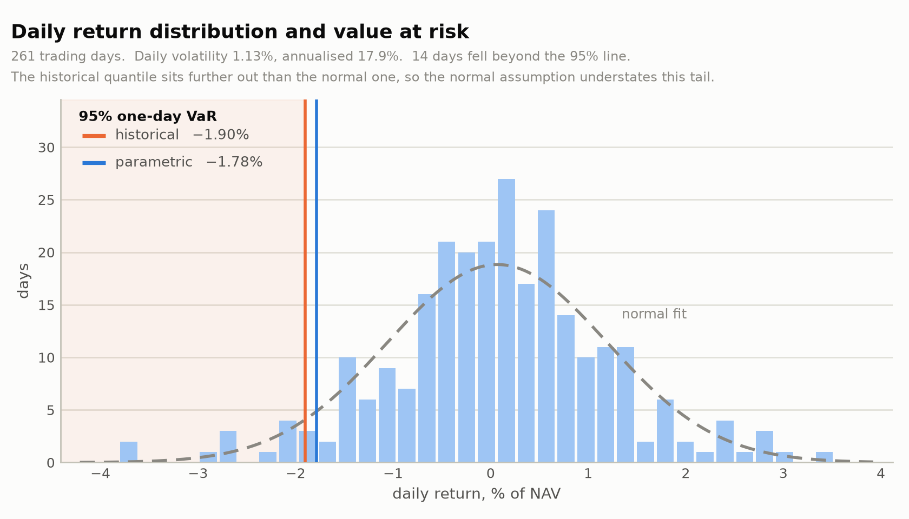
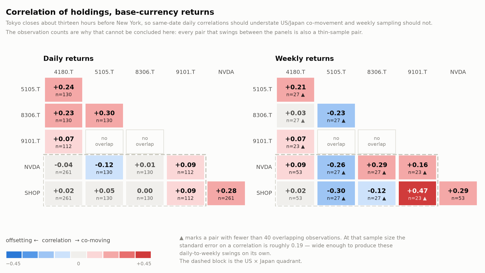
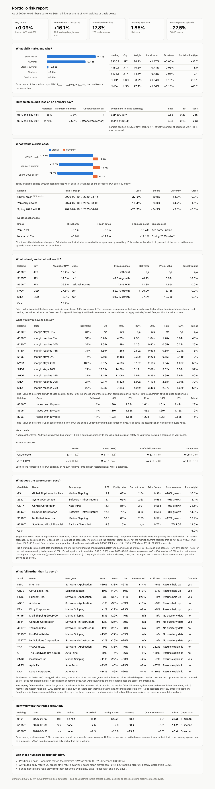

# Portfolio Risk & P&L Attribution Engine

A daily risk and P&L attribution report built on a live Interactive Brokers
account holding US and Japanese equities, reported in SGD base currency.

The point of the project is not the plumbing — it is answering, every day,
where the money actually came from. A multi-currency portfolio makes that
non-trivial: a Tokyo-listed holding can rise in yen while the yen falls
against the base currency, and the two effects have to be separated before
either can be judged.

**Status:** data pipeline, P&L attribution, factor exposure, risk and the
value/quality/momentum screener and intrinsic-value sizing complete, all
validated against the broker's own NAV, plus historical and hypothetical
stress tests, execution analysis and a one-page daily report.

---

## What it answers

1. **What did the portfolio make or lose?** — daily P&L in base currency.
2. **Why?** — split into local price move, FX move, their interaction,
   dividends, and trading costs.
3. **How much could it lose tomorrow?** — historical and parametric VaR,
   beta, correlation and concentration; stress tests *(planned)*.
4. **How well were trades executed?** — fills vs. arrival price and VWAP
   *(planned)*.

---

## Validation

Every figure the engine produces is checked against Interactive Brokers'
own reported numbers, because an attribution model that cannot reproduce
the broker's NAV is not worth reading.

**Position and NAV reconciliation** — stored positions converted to base
currency, plus cash and accruals, against the broker's reported NAV:

| Check | Result |
|---|---|
| Equity value vs. broker's reported equity | exact |
| Total NAV vs. broker's reported NAV | **0.000000% difference** |

**Daily return attribution** — the bottom-up attributed return against the
top-down NAV-implied return, over 261 trading days:

| Metric | Value | Reading |
|---|---|---|
| Mean difference | 0.44 bps/day | — |
| t-statistic on that mean | 0.25 | not significant; **attribution is unbiased** |
| Series correlation | 0.967 | — |
| Daily tracking error | 28.6 bps | residual noise |
| Lag-1 autocorrelation of the difference | −0.44 | a *timing* artefact, not a valuation error |

The negative autocorrelation is the informative number. An error that
systematically reverses the next day is a timing mismatch rather than a
mispricing, and it was traced to the FX snapshot instant: the broker
converts to base currency at its own fixing time, while the public FX
series used here is stamped at a different one. Re-running with the FX
series shifted one day moves that autocorrelation to +0.07 — essentially
zero — which identifies the cause without needing the broker's internal
fixings.

A competing hypothesis, that the Tokyo/New York asynchronous close was
responsible, was tested and **rejected**: lagging Tokyo prices made
tracking error roughly four times worse. That negative result is kept in
[`NOTES.md`](NOTES.md) alongside the rest of the diagnostic record.

---

## Methodology

### Currency decomposition

A holding's return in base currency is not the sum of its local return and
the FX return — the two compound:

```
R_base = (1 + r_local)(1 + r_fx) − 1
       = r_local + r_fx + r_local · r_fx
```

The engine reports all three terms separately rather than folding the
cross-term into either leg. It is small day to day but it is real, and
attributing it to the wrong leg quietly misstates whether a position made
money on the stock or on the currency.

Contribution to gross mark-to-market over the window:

| Sleeve | Local price move | FX move |
|---|---|---|
| JPY (Tokyo-listed) | +76.5% | −18.4% |
| USD | +44.9% | −2.7% |

The cross-term accounts for −0.3% over this window, which is why it is
reported rather than assumed away: negligible here, but not structurally
negligible, and it grows with volatility in either leg.

Read plainly: the Japanese sleeve's stock selection worked, and a weaker
yen against the base currency gave back roughly a quarter of it. That is
the kind of statement the decomposition exists to support.

### Reconstructing position history

The broker's Flex statement gives open positions only as a point-in-time
snapshot, not a daily history, so a naive daily return series cannot be
built from it directly. Instead, each holding's daily share count is
reconstructed by starting from today's known position and undoing each
trade in reverse chronological order. This is exact for any date inside
the statement's 365-day trade window, regardless of when the position was
originally opened.

### Deliberate exclusions

The broker's `fifoPnlRealized` is **not** added to the window's P&L. It
measures gain since a position's original cost basis, which may predate the
reporting window entirely — including it both double-counts the in-window
portion and imports gains that belong to an earlier period. It is retained
separately as a cross-check figure. This distinction is easy to miss and
was worth roughly 70% of an early reconciliation error.

Prices and FX are forward-filled across the date grid before differencing.
Without it, a holding with no print on a foreign market holiday causes the
surrounding day-pairs to be skipped, silently discarding that period's real
move.

---

## Factor exposure

Each sleeve's excess return is regressed on its own region's Fama-French
factors, in its own trading currency:

```
R_sleeve − RF = α + β_MKT·MKT + β_SMB·SMB + β_HML·HML
                  + β_RMW·RMW + β_CMA·CMA + β_MOM·MOM + ε
```

Regressing base-currency returns on USD-denominated factors would push
the FX move into the residual and corrupt α, since the factors cannot
explain currency. Separating local return from FX return in the
attribution step is what makes the correct version free.


Intervals are 95% Newey-West. HAC rather than plain OLS standard errors
because daily residuals are serially correlated — the same property that
showed up diagnosing the reconciliation residual — so OLS t-statistics
would be overstated here.

**Neither sleeve has a positive value loading**: USD −0.41 (t = −1.8),
JPY −0.07 (t = −0.2).

That is a fact about the book, and it is not a contradiction of the
strategy. HML is built on book-to-market: it measures whether stocks are
cheap against what they own today. Firm-foundation investing values
discounted *future* cash flows, and for a growing company most of those
are in the future, so growth is part of intrinsic value rather than its
opposite. An investor working from future cash flows can rationally hold a
high-multiple name, and will then load negatively on HML. The accurate
statement is that **this is a growth-oriented book, not an academic-HML
value one** — and that the test of the strategy is therefore a different
one: whether each price is below the value its expected growth supports.
That is taken up under "What is each holding worth?" below.

Two further readings. The USD sleeve carries market beta 1.53 with
R² 0.59, so a large part of it is simply leveraged market exposure; the
JPY sleeve's R² of 0.23 is far more idiosyncratic, which is what stock
selection is supposed to look like. And α is roughly +10%/yr in both
sleeves but with t of 0.33 and 0.50 — **indistinguishable from zero.**
One year of daily data cannot establish skill, and quoting the point
estimate without the t-statistic would be the easiest way to overclaim
on this project.


---

## Portfolio shape

Weights only; absolute values are deliberately omitted.

As of the latest snapshot:

| Holding | Listing | Currency | Weight (% of NAV) |
|---|---|---|---|
| 8306.T | Tokyo | JPY | 27.7 |
| NVDA | NASDAQ | USD | 26.8 |
| 5105.T | Tokyo | JPY | 14.5 |
| 4180.T | Tokyo | JPY | 10.5 |
| SHOP | NASDAQ | USD | 8.4 |
| Cash | — | SGD | 12.1 |

Sleeves: 52.7% JPY, 35.2% USD, 12.1% base-currency cash. Concentration is
high and deliberate — the investment approach is a concentrated
intrinsic-value one — which is exactly why the risk phase matters.

Note: the broker's `percentOfNAV` field is a share of the *equity sleeve*,
not of total NAV, and sums to 100% while ignoring cash. The weights above
are computed against total NAV.

---

## Risk

All figures in percent of NAV, over 261 trading days.

Annualised volatility is **17.9%**. One-day value at risk:

| Confidence | Historical | Parametric (normal) | Observations in tail |
|---|---|---|---|
| 95% | **1.90%** | 1.78% | 14 |
| 99% | 2.80% | 2.55% | **3 — not a usable estimate** |



Both estimates are reported because the gap between them is the finding.
Parametric VaR assumes returns are normal; historical VaR reads the
empirical quantile. Historical is worse at both levels, so the normal
assumption understates this tail — mildly, at 0.12pp on the 95% figure,
but in the direction the shape of the left tail predicts.

Every VaR figure carries the number of observations behind its tail, and
the 99% row is the reason that matters: at one year of daily data it rests
on three points. Quoting it as an estimate would be the easiest dishonest
number on this project, so the engine prints the count next to it rather
than leaving the reader to work out the sample size.

Re-running the same calculation on the broker's own NAV series instead of
the engine's attributed returns gives 1.85% historical and 1.75%
parametric — close enough that the risk figures do not depend on which
return series is used, which is a cross-check the two-source design makes
free.

### Beta

Portfolio and benchmark are both converted to base currency before
differencing. Beta should describe what happens to the investor's wealth,
which includes the currency move; the local-currency equity beta is a
different question and is answered by the factor regressions above.

| Benchmark | Beta | Correlation | R² |
|---|---|---|---|
| S&P 500 (SPY) | 0.65 | 0.48 | 0.23 |
| TOPIX (1306.T) | 0.38 | 0.43 | 0.18 |

Neither R² is large, which is the expected result for a five-name book and
consistent with the factor regressions: most of the variance here is
idiosyncratic rather than market.

### Correlation, and an honest non-result



Tokyo closes about thirteen hours before New York, so same-date daily
correlations should understate US/Japan co-movement while weekly sampling
spans the gap. This was written into the project's list of known traps
before the data was looked at, and the two panels were built to
demonstrate it.

**They do not.** Cross-market pairs move in both directions between the
panels, averaging about +0.03.

The observation counts printed in each cell explain why, and they are the
reason the chart is worth keeping. NVDA/SHOP is the only pair with the
full 53 weeks behind it, and it is also the only one that barely moves
(0.28 daily, 0.29 weekly). Every pair that swings hard has 23–27 weeks,
where the standard error on a correlation is roughly 0.19 — wide enough to
produce those swings on its own. So the instability is a sample-size
artefact, not a weekly-versus-daily effect, and the daily matrix is the
better-supported of the two until there is more history.

### Concentration

| Measure | Equity sleeve | Including cash |
|---|---|---|
| Largest weight | 31.5% | 27.7% |
| Herfindahl-Hirschman index | 0.243 | 0.202 |
| Effective number of positions (1/HHI) | **4.1** | 4.9 |

Five holdings that behave like roughly four equally weighted ones. Cash is
shown separately because it genuinely dilutes concentration, and reporting
only the equity sleeve would overstate how concentrated the account is.

---

## Screener: value, quality and momentum

The factor regression above says what the portfolio is *not*. This section
builds the metrics to say what it is, from financial statements rather than
from return covariance — an independent check on the same question.

Four metrics, each chosen for a reason:

- **Gross profitability** — (revenue − cost of revenue) / total assets.
  The further down the income statement you read, the more the figure has
  been shaped by depreciation schedules, tax strategy and one-offs. Its
  value here is that it is *negatively* correlated with book-to-market, so
  quality and value are additive rather than two names for one bet.
- **Piotroski F-Score** — nine binary tests across profitability,
  leverage/liquidity and operating efficiency. Designed to work *within*
  the value universe: cheap stocks are often cheap because they are dying,
  and the F-Score separates those from the ones recovering.
- **12-1 momentum** — return from twelve months ago to one month ago. The
  skipped month is not a convenience; short-horizon reversal is a separate
  and opposite effect.
- **Price-to-book, flagged below 1.0 for Tokyo listings** — in Japan this
  is a catalyst, not a valuation measure. The Tokyo Stock Exchange's March
  2023 reform asked sub-book companies to publish capital-efficiency
  plans.

### No reading before it was knowable

A fiscal year ending 31 March is not public knowledge on 31 March; the
filing lands in June. Every stored statement row therefore carries an
explicit availability date of fiscal year-end plus 90 days, and every read
filters on that column rather than on the fiscal date. A screen run for a
past date cannot see a filing that had not happened.

The lag is deliberately conservative. A real filing calendar would be more
precise, but erring late only understates a result, whereas erring early
manufactures one.

### Refusing to score

A bank reports no cost of revenue and no current/non-current balance-sheet
split, because neither concept applies to it. That leaves gross
profitability undefined and two of the nine F-Score tests unevaluable for
the largest holding.

Seven of nine tests remain computable — and computing them would be the
real error. A bank's operating cash flow tracks changes in loans and
deposits; the holding here reports roughly −¥23tn, which says nothing
about whether the bank is healthy. The cash-flow and accruals tests would
score balance-sheet growth and label it earnings quality. Piotroski's
original sample excludes financial firms for exactly this reason, so the
score is **withheld entirely** rather than reported with a caveat: 4 of 7
sitting beside a genuine 4 of 7 reads as a weak company rather than an
unmeasured one.

Detection is structural — no cost of revenue *and* no current/non-current
split, across every year — rather than a sector label, because the absence
of both concepts is the balance sheet itself saying what the company is.

---

## Sector-neutral ranking

A raw metric means little across sectors. Gross profitability of 0.08 is
poor for a software company and ordinary for a shipping line; a
price-to-book of 0.95 is cheap for a semiconductor maker and unremarkable
for a Japanese regional bank. Ranking one list would mostly rank sectors.

So each holding is scored against its own verified peer group — 132
symbols in total, six holdings and 126 peers — and no number is compared
across groups.

### Curate by hand, verify by machine

There is no free source of clean sector membership for a mixed
Tokyo/US/Greek/Danish universe, so the peer lists are hand-written. That
makes them the weakest link: a mistyped or repurposed ticker sits silently
inside a group and shifts every percentile in it. So nothing curated is
trusted — each candidate must resolve to an *equity* whose reported sector
matches its holding's, and the rejections are printed.

It earned its place immediately.

**Ticker reuse.** `EGLE` belonged to Eagle Bulk Shipping until Star Bulk
acquired it, and now belongs to a Global X S&P 500 ETF. `GOGL` belonged to
Golden Ocean until the CMB.TECH merger, and now belongs to a 2×
leveraged Google ETF. Both return live price data and would survive any
"does this ticker resolve?" check. Only the instrument type distinguishes
them from the shipping companies they used to be — which is why the equity
test is explicit rather than incidental.

**Taxonomy encoding a real distinction.** Six oil-tanker operators were
rejected as Energy rather than Industrials. That is correct: crude and
product tankers classify under Energy, while dry bulk, container and car
carriers sit under Industrials. The holding is the latter, so the
rejection kept the comparison inside one cycle instead of blurring two.

Also dropped: eleven delisted tickers, including five Japanese regional
banks that reorganised into holding companies under new codes, and several
of the author's own misclassifications.

### The result that reframes everything else

| | Holding's 12-1 return | Peer median | Rank |
|---|---|---|---|
| Tokyo-listed bank vs Japanese banks | +62.7% | **+86.5%** | 22 of 23 |
| Tokyo-listed shipper vs marine shipping | +44.5% | **+67.3%** | 19 of 20 |

On raw momentum these are the two strongest names in the book. Against
their own sectors they are near the bottom. Japanese banks rallied on rate
normalisation and shipping on freight rates; the positions captured the
sector and gave back 23 to 24 points of it.

*"I owned a stock that rose 63%"* and *"I picked a good bank"* are
different claims. This is the view that separates them.

Percentiles within each holding's own peer group, 100 = best:

| | B/M | gross prof. | F | mom | value | +quality | +mom |
|---|---|---|---|---|---|---|---|
| 4180.T | 56 | 56 | 22 | 39 | 56 | 47 | 44 |
| 5105.T | 45 | **100** | 14 | 41 | 45 | 51 | 48 |
| 8306.T | 17 | — | — | 9 | 17 | withheld | withheld |
| 9101.T | 68 | 60 | 25 | 10 | 68 | 55 | 40 |
| NVDA | 13 | **100** | 7 | 39 | 13 | 33 | 35 |
| SHOP | 28 | 42 | 38 | 42 | 28 | 34 | 37 |

Two readings worth drawing out. Sector-neutralising moves the value
conclusion: a 1.88× price-to-book looks moderate in isolation but ranks
20th of 23 against Japanese banks. And four of six holdings sit below
their sector's median book-to-market, so **the book is not value-tilted on
a sector-neutral basis either** — a third independent method reaching the
factor regression's conclusion.

The 7th-percentile F-Score on the semiconductor holding is *not* a quality
verdict; it has the best gross profitability in its group. The F-Score
rewards year-on-year improvement and balance-sheet conservatism, so a
company already at peak margins and investing heavily scores badly even
when the business is exceptional. It is the wrong instrument for that
name, and saying so is more useful than quoting the number.

A composite is withheld when a sleeve it names does not exist: "value +
quality" computed without a quality measurement is the value score under
another label, and would sit in the same column as composites that
genuinely carry both.

---

## Does any of it predict anything?

The build order called for a backtest of value-only against value+quality
against value+quality+momentum. That is not supportable on this data: the
free fundamentals source gives four or five annual statements, so after
the reporting lag there are three or four annual rebalances. Three
observations is an anecdote, and a weak backtest is worse than none —
a reader who notices the sample size discounts everything near it.

So the question is asked **across companies rather than across time**.
Each name is scored as of a past date using only fundamentals available
then, and the ranking is tested against the following year's return
*relative to its own peer group's median*. That trades time-series depth,
which this data lacks, for cross-sectional breadth, which it has: ~130
names per window instead of three rebalances. Two non-overlapping annual
windows, reported separately and never pooled.

Spearman rank correlation of each signal against forward excess return:

| Signal | 2024-09 → 2025-09 | 2025-09 → 2026-09 | Verdict |
|---|---|---|---|
| Book-to-market | **+0.183** | +0.091 | positive both |
| Gross profitability | −0.124 | **−0.164** | negative both |
| F-Score ratio | −0.050 | −0.069 | negative, negligible |
| 12-1 momentum | −0.055 | +0.152 | **sign flips** |
| Value | **+0.183** | +0.091 | positive both |
| Value + quality | +0.051 | −0.028 | one negligible |
| Value + quality + momentum | +0.045 | +0.097 | one negligible |

**The answer is the opposite of the expected one: adding quality to value
made it worse, in both windows.** Gross profitability was negatively
related to within-sector outperformance in both years, and in the second
window the tercile spread was −36.7% — the top third by gross
profitability averaged +0.7% against its sector while the bottom third
averaged +37.4%. Value was the only signal to hold a non-negligible sign
across both windows. Momentum changed sign, which rules out reading either
window's momentum result alone.

This does **not** say the gross-profitability literature is wrong. The
proxy here is annual gross profitability from a free data source plus a
coarse F-Score ratio available for only 82 to 108 of 132 names, against a
literature built on far better data and decades of history. Two adjacent
windows are two draws from one regime, dominated by the same bank and
shipping rallies. Every name is a survivor — not a hypothetical concern
given that two candidate tickers turned out to be ETFs occupying the codes
of acquired companies. And the p-values assume independent observations,
which returns in a single cross-section are not.

What it supports is narrower and still worth saying: in this universe over
these two years, quality as measured here detracted from value rather than
adding to it, and value was the only signal that held its direction.

Set beside the portfolio, that is worth stating plainly. Three methods
found the book is not tilted to cheapness on book or earnings, and the
validation finds cheapness is the one signal in this data with any
consistency behind it. **The book does not carry the one factor this data
supports.** That is a statement about factor exposure, not a verdict on
the strategy: a book built on expected growth is not trying to own that
factor, and stands or falls on whether the growth it pays for arrives.

---

## What is each holding worth?

Everything above measures the book against factor definitions of value —
cheapness on today's book and earnings. Firm-foundation value is something
else: the present value of the cash a company will produce, growth
included. This step uses that yardstick: estimate what each holding is
worth from the cash it returns to owners, and compare that with the price.

Two models, because one does not fit a bank. Non-financials get a
discounted cash flow on *owner cash flow* — operating cash flow less capex
less stock-based compensation, which is non-cash but paid for by owners in
dilution (22% of one holding's operating cash flow). The bank gets a
residual-income model, book value plus the present value of profit above
its cost of equity, because a bank's operating cash flow measures deposit
and loan flows rather than earnings.

A DCF on a fast grower is mostly its growth assumption, so each valuation
is also solved backwards: what does today's price assume, and how does
that compare with what the company has delivered?

| | Held | Price assumes | Delivered | Price / base value | Target |
|---|---|---|---|---|---|
| 5105.T | 16.5% | cash flow shrinking 7.6%/yr | revenue +6.2%/yr | 0.63x | 18.3% |
| 8306.T | 31.5% | permanent ROE of 15.0% | ROE 11.3% | 1.69x | 0% |
| NVDA | 30.5% | 51% growth, fading over 10 years | revenue +100%/yr | 3.00x | 0% |
| SHOP | 9.6% | 89% growth, fading over 10 years | revenue +27%/yr | 11.74x | 0% |
| 4180.T | 11.9% | withheld | | | — |

Prices as of 2026-09-30. "Held" is each stock's share of the invested book. The target is half the
margin of safety, nothing below a 15% margin, capped at 25% per name, with
the remainder in cash.

**One of five holdings trades below its estimated value**, and it is the
one whose discount survives the bear case and a cost of equity up to about
11% against the 7.5% the model uses. The rule would hold 82% cash.

Two readings of that table matter more than the targets. The base case
caps starting growth at 20%, which is what makes NVDA look like three
times its value — but the price needs only about half the growth NVDA has
actually produced. That multiple says more about the cap than the stock.
SHOP is the reverse: it needs three times its delivered growth, which can
only come from margin expansion the model does not allow for.

4180.T has no value under this model rather than a value of zero: its
owner cash flow is negative in every year available, and a company
investing more than it generates cannot be valued from current cash flow.
It gets no target in either direction.

### What would you have to believe?

The base case is cautious by construction, and for a growth holding its
multiple mostly restates that caution. The more useful output is a ladder:
price ÷ value across a range of starting growth rates, so the question
becomes which column the owner actually believes.

| | Delivered | 20% | 30% | 40% | 50% | Fair at |
|---|---|---|---|---|---|---|
| NVDA, margin stays 41% | 100% | 3.15x | 2.19x | 1.54x | 1.09x | 53% |
| SHOP, margin stays 10% | 27% | 10.11x | 7.08x | 5.02x | 3.59x | 92% |
| SHOP, margin reaches 25% | 27% | 4.96x | 3.40x | 2.37x | 1.67x | 65% |
| 4180.T, margin reaches 10% | 31% | 1.26x | 0.82x | 0.55x | 0.37x | 25% |
| 5105.T, margin stays 9% | 6% | 0.32x | 0.22x | 0.15x | 0.11x | −7% |

Prices as of 2026-10-07. Read across a row until the multiple drops below 1.00x: that is the
starting growth the price requires, fading to a terminal rate over ten
years. NVDA is fair at about half the growth it has delivered. SHOP needs
more than twice its delivered growth even if its cash-flow margin rises
two and a half times. 4180.T, which the constant-margin model could not
value at all, is fair at growth below what it has delivered provided its
margin turns to 10%. For the bank the equivalent ladder is in return on
equity: fair at a 15% starting ROE fading over forty years, against 11%
delivered.

The margin rows exist because holding today's margin constant prices one
kind of company harshly and cannot value another. They are a grid, not a
forecast. The forecast belongs to the owner: `config/valuation.py` has a
`THESIS` entry per holding, and the engine values each stock under it.
None is filled in by default.

Assumptions — risk-free rates, equity risk premium, terminal growth, the
scenario definitions and the sizing rule — are stated in
`config/valuation.py`, not estimated, and printed above every result.

---

## What would a crisis cost?

VaR describes an ordinary bad day. A stress test asks what today's
portfolio would lose in a named event, including ones worse than anything
in the year VaR was estimated on.

**Historical replay.** Today's weights carried through three past episodes
on what each holding and each currency actually did. The loss is the worst
peak-to-trough fall of the replayed portfolio inside each window, on the
portfolio's own dates — Tokyo and New York did not bottom on the same day
— and is split into stock and currency moves with the same identity used
for daily attribution.

| Episode | Peak → trough | Loss (% NAV) | Stocks | FX | Cross |
|---|---|---|---|---|---|
| COVID crash | 2020-02-19 → 03-16 | −27.4% | −29.9% | +3.4% | −0.9% |
| Yen carry unwind | 2024-07-10 → 08-05 | −19.4% | −23.1% | +4.8% | −1.1% |
| Spring 2025 selloff | 2025-02-18 → 04-07 | −21.9% | −24.2% | +3.0% | −0.6% |

These are 10–14 times the one-day 95% VaR. Scaling that VaR by the square
root of time gives about 8% for the 18 trading days of the COVID drawdown,
against 27% replayed: the scaling assumes independent days, and a crash is
the case where they are not.

One holding listed in 2021 and did not trade during the first episode. It
is neither dropped nor held flat: it is proxied by its beta to its local
index, and the proxied share of NAV (10.5%) is printed with the result.

**Hypothetical shocks, and why one of them has three answers.**

| Shock | Direct only | + calm betas | + episode betas |
|---|---|---|---|
| Yen +10% | +6.3% | +3.6% | −16.5% |
| Nasdaq −15% | 0.0% | −11.7% | −17.0% |

About 63% of NAV is in yen once cash is counted, so a stronger yen is a
translation *gain*: +6.3% if nothing else moves. Adding each stock's
sensitivity to the yen, measured over two years of weekly returns, barely
changes that, because in ordinary weeks the yen explains almost none of
these stocks' moves (R² of 0.00–0.04).

But the yen does not rally 10% in an ordinary week. The one time it did,
in August 2024, carry trades were being unwound and every holding fell
20–31% — including the US names with no yen exposure. Taking sensitivities
from that episode turns the same shock into a 16.5% loss. An episode beta
is a single observation, not an estimate, and is labelled as one; it is
also the only column of the three that matches what happened.

The Nasdaq shock shows the same effect from the other side. The US
holdings' betas barely change between calm and stressed. The gap is the
Tokyo holdings, whose sensitivity to the Nasdaq roughly doubles or triples
in a selloff: the cross-market diversification visible in ordinary weeks
is mostly absent when it would matter.

---

## How well were the trades executed?

Every fill is measured against the bid/ask midpoint when the order was
submitted (the arrival price), against the day's volume-weighted average
price, and against the close. Basis points, signed so that positive is
always a cost.

**The account has three fills**, so this is a per-trade record and no
averages are reported.

| | Side | Waited | vs arrival | vs day VWAP | vs close | Commission + tax | All-in |
|---|---|---|---|---|---|---|---|
| 9101.T | sell | 62 min | −45.9 | +123.2 \* | −48.6 | +8.7 | −37.2 |
| 5105.T | buy | none | +2.5 | +2.0 | −58.4 | +8.7 | +11.2 |
| 8306.T | buy | none | −2.3 | +28.9 | −13.4 | +8.7 | +6.4 |

\* VWAP from bars covering 9% of that day's volume.

The two marketable buys filled within about a tick of the midpoint, so
their cost is essentially the commission. The sell was a resting limit
order filled an hour later at a better price than when it was placed.

The checks are the more transferable part:

- **Benchmark resolution.** On one-minute quote bars, one of these fills
  showed +18.0 bps of arrival slippage. On five-second bars the same fill
  is −2.3 bps. The quote had moved in the 48 seconds between the last
  one-minute bar and the order, and the stale benchmark booked that move
  as execution cost. The report uses the finest bars available and prints
  what the coarser ones would have said.
- **Time zones.** The broker's timestamps carry no zone. Each fill is
  checked against the high-low range of the one-minute bar it should fall
  in, on every run.
- **VWAP coverage.** Bar volume is compared with the exchange's own
  reported volume. For one of the three days the bars carry 9% of it, so
  that VWAP is flagged as not the market's.
- **Survivorship.** Orders that never filled are not in the statement. A
  patient limit order can therefore only appear here as a success, and
  one good fill says nothing about whether resting limits pay on average.

---

## Screening for candidates

The same question is asked across the whole peer universe — 132 names —
in two stages, and the sizing rule is applied to what survives.

**Stage one: three ratios read straight off the statements.**

| Test | Threshold | Asks |
|---|---|---|
| PER (price ÷ earnings per share) | at most 15 | Is it reasonably priced on current profit? |
| Equity ratio (equity ÷ total assets) | at least 40% | Is it funded mostly by its owners? |
| Current ratio (current assets ÷ current liabilities) | at least 150% | Can it pay what falls due this year? |

A company with no profit has no PER and fails. The two balance-sheet tests
do not apply to a bank — equity is about 5% of assets by design and there
is no current/non-current split — so banks are judged on PER alone and
marked as such, not failed on tests that cannot measure them.

Of 128 names with comparable statements, 95 fail on PER, 7 more on equity
ratio and 3 more on current ratio. **23 pass**, one of them a current
holding.

**Stage two: price against intrinsic value**, with four rules that remove
names that are cheap for a bad reason, each removal listed with its rule:

- **Reporting currency must match trading currency.** A US-listed ADR
  prices in dollars and reports in its home currency; a per-share value
  from those statements is not comparable with the price.
- **Cash flow must have held up in the worst year on record**, which stops
  a cyclical business being valued off its best years.
- **The discount must survive the bear case.**
- **A price below a third of estimated value is treated as a data problem
  to check, not a bargain.**

**6 names pass both stages**, none of them a current holding. Four
holdings stop at PER. The fifth passes stage one and is below value, but
its cash flow was negative in 2022, which a three-year average hides and
the worst-year rule does not.

The two stages disagree usefully. Nineteen names the valuation calls at
least 15% cheap never reach it: thirteen on PER, five on equity ratio, one
on current ratio. A DCF
on owner cash flow can call a leveraged company cheap; the equity ratio is
what says it is leveraged.

**Has it worked?** Both stages were run as of two past dates, using only
data available then, and compared with each stock's return over the
following year relative to its peer group's median.

| As of | Pass stage one | Fail stage one | Pass both stages | Value/price rank correlation |
|---|---|---|---|---|
| 2024-09-30 | +1.7% (41) | −1.5% (87) | +1.6% (17) | +0.089 (p 0.37) |
| 2025-09-30 | +3.8% (34) | −3.2% (94) | +9.2% (8) | +0.095 (p 0.33) |

The direction is right in both windows and the size is small. Two windows
from one market regime, survivors only, and the final set rests on 17 and
8 names. This supports treating the output as a list of names to research.
It does not show that the implied portfolio is better than the one held.

---

## Stocks that fell further than their peers

A contrarian screen: find stocks that have dropped much more than
comparable companies, and check whether the business did.

A stock is flagged when its price is down over six months, it sits in the
bottom fifth of its own peer group, and it is at least 15 points behind
that group's median — measured against peers so that a sector-wide fall
flags nobody. For each flagged stock the latest quarter is compared with
the same quarter a year earlier.

Of 132 names, 15 are flagged. For five the results give a reason (losses,
falling revenue, a 37% drop in profit). For five the results held up. For
the remaining five — all smaller Tokyo listings — there is no quarterly
data to judge by, and that is reported as unknown, never as good news.

"Results held up" is deliberately not called "irrational". It means the
obvious explanation is absent from the last reported quarter. Prices also
move on things no income statement shows yet, and four of those five are
US software and semiconductor companies in a year when the market has
been repricing software on AI.

**Does buying fallers work?** At each month-end over five years, the worst
fifth of every peer group was followed against its peers.

| Held | Median faller vs. peers | Mean gap vs. the rest | Fallers beating peers |
|---|---|---|---|
| 3 months | +1.0% | +1.7% | 51% |
| 6 months | +0.7% | +1.1% | 49% |
| 12 months | +0.4% | +3.0% | 48% |

The typical faller does about as well as its peers and about half beat
them. The average is a little better because a minority rebound hard: a
lottery-ticket payoff, which argues for holding several fallers and not
one. Even that is an upper bound — companies that fell until they were
delisted are not in the universe, so every faller in the test survived.

The screen's first run also flagged a bank as down 84%. It had split its
shares ten for one and the stored prices were only partly adjusted. Any
name with a one-day move over 50% in the window is now set aside and
reported.

---

## The daily report

Everything above is recomputed each day into one page:



[`reports/daily_report.html`](reports/daily_report.html) is a single
self-contained file — inline CSS and SVG, no JavaScript, no network
requests — built by `src/report/build_report.py`. It answers the four
questions for the latest day, shows the valuation view, and ends with a
section on whether the numbers can be trusted today: the reconciliation
against the broker's NAV and the tracking error of the attribution.

No figure on it is a currency amount. Every number is a percent of NAV, a
weight, a ratio or basis points, and that is structural: the functions
that build each section convert to fractions of NAV before anything
reaches the page.

The figures on the page are as of the day it was built, so they differ
slightly from the dated sections above.

---

## Architecture

```
IBKR Flex Web Service ─┐
IB Gateway (read-only) ─┼─→ data layer ─→ SQLite daily snapshots ─→ attribution ─→ reconciliation
yfinance (FX, prices) ─┘
```

SQLite is the durable store, not a cache. The Flex statement only serves a
rolling 365-day window, so anything not captured is eventually unavailable;
snapshots accumulate a history the source cannot reproduce later. All
writes are idempotent upserts on natural keys, so re-running a day's pull
never duplicates rows.

```
src/
├── data/
│   ├── flex.py          # Flex download, XML parsing, raw-statement caching
│   ├── market_data.py   # FX, benchmark and per-holding price history
│   ├── factor_data.py   # Fama-French factors (Kenneth French library)
│   ├── fundamentals.py  # annual statements, stored with availability dates
│   ├── test_flex.py     # connectivity test: positions via Flex
│   ├── ibkr_live.py     # intraday bars around each trade (Gateway, read-only)
│   └── test_live.py     # connectivity test: positions via IB Gateway
├── screener/
│   ├── quality.py       # gross profitability, F-Score, momentum, P/B
│   ├── universe.py      # peer-group resolution and verification
│   ├── fetch_universe.py# bulk fundamentals and prices for the universe
│   ├── composite.py     # sector-neutral percentiles and composites
│   ├── validate.py      # cross-sectional validation over two windows
│   ├── candidates.py    # two-stage value screen, rules, suggested weights
│   └── fallen.py        # stocks that fell further than peers, and why
├── sizing/intrinsic.py  # DCF, residual income, margin-of-safety sizing
├── storage/db.py        # schema and idempotent upserts
├── analytics/
│   ├── pnl.py           # attribution, daily returns, roll-ups
│   ├── factors.py       # factor regressions, OLS + Newey-West
│   ├── risk.py          # VaR, beta, correlation, concentration
│   ├── stress.py        # historical replays and hypothetical shocks
│   └── tca.py           # execution vs. arrival price, VWAP and close
├── report/
│   ├── plots.py         # charts
│   └── build_report.py  # the one-page daily HTML report
├── run_daily.py         # refresh, reconcile, build the report
└── checks/reconcile.py  # NAV reconciliation
```

---

## Running it

Requires Python 3.14 and an Interactive Brokers account with a configured
Flex Query.

```bash
python -m venv .venv && .venv/bin/pip install -r requirements.txt
cp .env.example .env        # then fill in FLEX_TOKEN and FLEX_QUERY_ID
```

The daily run is one command — refresh the statement and prices,
reconcile, fetch intraday bars if IB Gateway is up, build the report:

```bash
python src/run_daily.py
```

The individual steps, in order:

```bash
python src/data/flex.py          # download, parse and store the statement
python src/data/market_data.py   # FX, benchmark and holding price history
python src/checks/reconcile.py   # verify against the broker's NAV
python src/analytics/pnl.py      # attribution and daily-return validation
python src/data/factor_data.py   # Fama-French factor returns
python src/analytics/factors.py  # factor regressions
python src/analytics/risk.py     # VaR, beta, correlation, concentration
python src/analytics/stress.py   # historical replays and hypothetical shocks
python src/report/plots.py       # regenerate the charts above
```

Then the screener, which has its own universe to assemble:

```bash
python src/data/fundamentals.py      # statements for the holdings
python src/screener/quality.py       # the four metrics, holdings only
python src/screener/universe.py      # resolve and verify peer groups
python src/screener/fetch_universe.py# fundamentals + prices for all 132
python src/screener/composite.py     # sector-neutral percentiles
python src/screener/validate.py      # cross-sectional validation
```

Then valuation and sizing, and the checks on its maths:

```bash
python src/sizing/intrinsic.py       # intrinsic value, margin of safety, targets
python src/screener/candidates.py    # value screen across the universe
python src/screener/fallen.py        # fell further than peers; fetches quarterlies
python tests/test_intrinsic.py       # valuation maths against closed forms
python tests/test_stress.py          # stress maths against hand-worked paths
python tests/test_tca.py             # execution maths and time-zone handling
python tests/test_candidates.py      # screening rules and weight caps
python tests/test_fallen.py          # fallen-stock rules and the history test
```

Execution analysis needs IB Gateway running on port 4001 with the
read-only API enabled, for the intraday bars:

```bash
python src/data/ibkr_live.py     # one-minute and five-second bars per trade
python src/analytics/tca.py      # slippage vs. arrival, VWAP and close
```

The live-position test additionally needs IB Gateway running on port 4001
with the read-only API enabled:

```bash
python src/data/test_live.py
```

`run_daily.py` covers the daily steps. Factor returns, fundamentals and the
peer universe change slowly and are run by hand when needed.

### Safety

The engine is strictly read-only. It never places, modifies or cancels
orders, and connects with `readonly=True` against a gateway that has the
read-only API enabled. Credentials live only in `.env`; raw statements,
the SQLite store and the account identifiers are excluded from version
control.

---

## Known limitations

- **Entry and exit day pricing.** On a day a trade opens or closes a
  position, the model anchors to that day's close rather than the actual
  execution price, so the execution-to-close move is unattributed. The
  broker reports a per-trade figure that would close this exactly; wiring
  it in is a known improvement.
- **Residual tracking error.** The ~29 bps of daily noise that remains is
  largely the broker's own mark price versus the public closing print, and
  cannot be eliminated without the broker's historical marks.
- **No per-holding history before the trade window.** Reconstruction is
  exact only inside the statement's 365-day window. Accumulated snapshots
  extend coverage going forward but cannot be backfilled.
- **Corporate action handling is untested.** The account has had none in
  the window, so the parser for them is written to the documented schema
  but unverified against real data.
- **The 99% VaR is not usable at this sample size.** Three tail
  observations is not an estimate. It is printed with its observation
  count rather than omitted, because the count is the honest way to say
  so, and it becomes meaningful as the snapshot history accumulates.
- **VaR has not been cross-checked against the broker's own figure.**
  Interactive Brokers computes a VaR in Portfolio Analyst, but it is not
  exposed through the Flex Query, so the comparison stays manual.
- **Public price data needs cleaning.** The benchmark series carried two
  mis-scaled days that inflated its volatility from 1.3% to 43% and drove
  a beta estimate to nearly zero. Ingestion now drops points more than 2×
  from their own five-day centred median, but this is a mitigation for a
  known failure mode, not a guarantee against the next one.
- **Fundamentals history is shallow.** The public source offers four or
  five annual statements, which is why the screener is validated
  cross-sectionally rather than backtested through time — three annual
  rebalances would not support the latter.
- **Peer groups are hand-curated.** Verification against each issuer's
  reported sector and instrument type catches wrong tickers, but it
  cannot catch a *missing* peer, so a group may be unrepresentative in
  ways the rejections do not reveal.
- **Survivorship bias is live, not theoretical.** The universe is built
  from tickers trading today. Two candidates turned out to be ETFs
  occupying the codes of shipping companies that had been acquired, which
  is the bias in its most concrete form.
- **Quality is crudely measured.** Annual gross profitability from a free
  source plus an F-Score ratio available for 82 to 108 of 132 names is a
  weak proxy for the constructs in the literature, so the finding that
  quality detracted from value is a result about this measurement in this
  universe, not about the factor.

---

## Roadmap

| Phase | Scope | Status |
|---|---|---|
| 0 | Broker connectivity, credentials, repo setup | Complete |
| 1 | Flex parsing, SQLite snapshots, market data, NAV reconciliation | Complete |
| 2 | P&L attribution: stock vs. FX vs. dividends vs. fees | Complete |
| 4a | Factor exposure against Fama-French factors, US and Japan separately | Complete |
| 3 | VaR, beta, correlation, concentration | Complete |
| 4b–c | Quality/momentum screener, sector-neutral composite | Complete |
| 4d | Cross-sectional validation (backtest reframed; see above) | Complete |
| 4d | Margin-of-safety sizing from DCF / residual income | Complete |
| 5 | Stress tests, including the 2024 yen carry unwind | Complete |
| 6 | Execution analysis vs. arrival price and VWAP | Complete |
| 7 | Daily HTML report and single entry point | Complete |

Phase 4a precedes phase 3 deliberately: factor exposure is the more
informative diagnostic for a concentrated book, and both depend on the same
daily return series.
