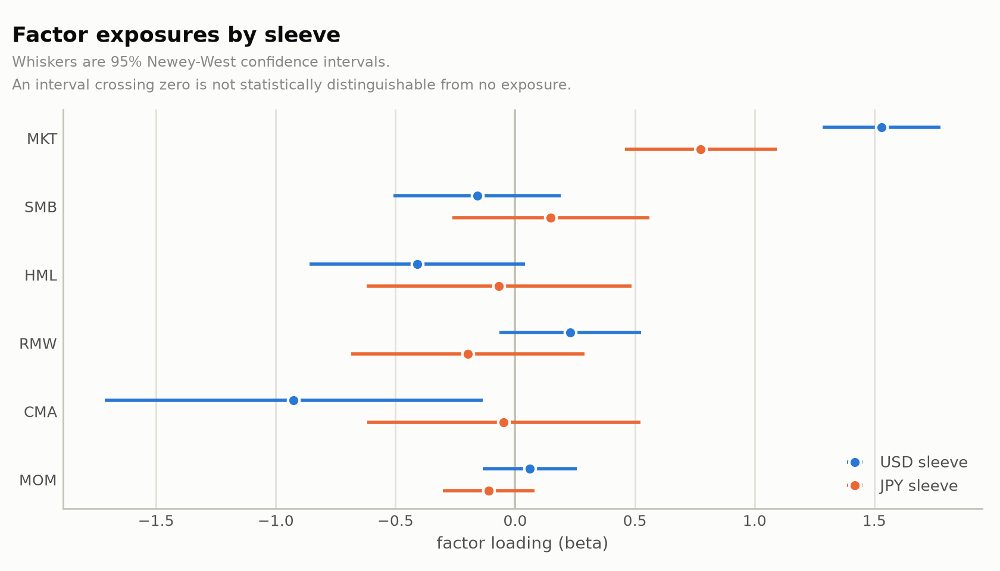
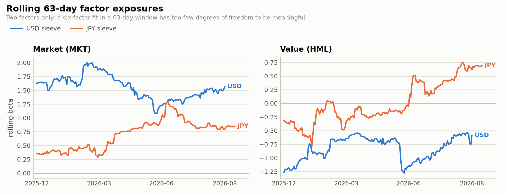

# Portfolio Risk & P&L Attribution Engine

A daily risk and P&L attribution report built on a live Interactive Brokers
account holding US and Japanese equities, reported in SGD base currency.

The point of the project is not the plumbing — it is answering, every day,
where the money actually came from. A multi-currency portfolio makes that
non-trivial: a Tokyo-listed holding can rise in yen while the yen falls
against the base currency, and the two effects have to be separated before
either can be judged.

**Status:** data pipeline, P&L attribution and factor exposure complete, all
validated against the broker's own NAV. Risk (VaR, correlation, concentration)
is next.

---

## What it answers

1. **What did the portfolio make or lose?** — daily P&L in base currency.
2. **Why?** — split into local price move, FX move, their interaction,
   dividends, and trading costs.
3. **How much could it lose tomorrow?** — VaR and stress tests *(in progress)*.
4. **How well were trades executed?** — fills vs. arrival price and VWAP
   *(planned)*.

---

## Validation

Every figure the engine produces is checked against Interactive Brokers'
own reported numbers, because an attribution model that cannot reproduce
the broker's NAV is not worth reading.

**Position and NAV reconciliation** — stored positions converted to base
currency, plus cash and accruals, against the broker's reported NAV:

| Check | Result |
|---|---|
| Equity value vs. broker's reported equity | exact |
| Total NAV vs. broker's reported NAV | **0.000000% difference** |

**Daily return attribution** — the bottom-up attributed return against the
top-down NAV-implied return, over 261 trading days:

| Metric | Value | Reading |
|---|---|---|
| Mean difference | 0.44 bps/day | — |
| t-statistic on that mean | 0.25 | not significant; **attribution is unbiased** |
| Series correlation | 0.967 | — |
| Daily tracking error | 28.6 bps | residual noise |
| Lag-1 autocorrelation of the difference | −0.44 | a *timing* artefact, not a valuation error |

The negative autocorrelation is the informative number. An error that
systematically reverses the next day is a timing mismatch rather than a
mispricing, and it was traced to the FX snapshot instant: the broker
converts to base currency at its own fixing time, while the public FX
series used here is stamped at a different one. Re-running with the FX
series shifted one day moves that autocorrelation to +0.07 — essentially
zero — which identifies the cause without needing the broker's internal
fixings.

A competing hypothesis, that the Tokyo/New York asynchronous close was
responsible, was tested and **rejected**: lagging Tokyo prices made
tracking error roughly four times worse. That negative result is kept in
[`NOTES.md`](NOTES.md) alongside the rest of the diagnostic record.

---

## Methodology

### Currency decomposition

A holding's return in base currency is not the sum of its local return and
the FX return — the two compound:

```
R_base = (1 + r_local)(1 + r_fx) − 1
       = r_local + r_fx + r_local · r_fx
```

The engine reports all three terms separately rather than folding the
cross-term into either leg. It is small day to day but it is real, and
attributing it to the wrong leg quietly misstates whether a position made
money on the stock or on the currency.

Contribution to gross mark-to-market over the window:

| Sleeve | Local price move | FX move |
|---|---|---|
| JPY (Tokyo-listed) | +76.5% | −18.4% |
| USD | +44.9% | −2.7% |

The cross-term accounts for −0.3% over this window, which is why it is
reported rather than assumed away: negligible here, but not structurally
negligible, and it grows with volatility in either leg.

Read plainly: the Japanese sleeve's stock selection worked, and a weaker
yen against the base currency gave back roughly a quarter of it. That is
the kind of statement the decomposition exists to support.

### Reconstructing position history

The broker's Flex statement gives open positions only as a point-in-time
snapshot, not a daily history, so a naive daily return series cannot be
built from it directly. Instead, each holding's daily share count is
reconstructed by starting from today's known position and undoing each
trade in reverse chronological order. This is exact for any date inside
the statement's 365-day trade window, regardless of when the position was
originally opened.

### Deliberate exclusions

The broker's `fifoPnlRealized` is **not** added to the window's P&L. It
measures gain since a position's original cost basis, which may predate the
reporting window entirely — including it both double-counts the in-window
portion and imports gains that belong to an earlier period. It is retained
separately as a cross-check figure. This distinction is easy to miss and
was worth roughly 70% of an early reconciliation error.

Prices and FX are forward-filled across the date grid before differencing.
Without it, a holding with no print on a foreign market holiday causes the
surrounding day-pairs to be skipped, silently discarding that period's real
move.

---

## Factor exposure

Each sleeve's excess return is regressed on its own region's Fama-French
factors, in its own trading currency:

```
R_sleeve − RF = α + β_MKT·MKT + β_SMB·SMB + β_HML·HML
                  + β_RMW·RMW + β_CMA·CMA + β_MOM·MOM + ε
```

Regressing base-currency returns on USD-denominated factors would push
the FX move into the residual and corrupt α, since the factors cannot
explain currency. Separating local return from FX return in the
attribution step is what makes the correct version free.



Intervals are 95% Newey-West. HAC rather than plain OLS standard errors
because daily residuals are serially correlated — the same property that
showed up diagnosing the reconciliation residual — so OLS t-statistics
would be overstated here.

**The result contradicts the stated strategy, which is the interesting
part.** An intrinsic-value approach predicts a positive HML loading.
Neither sleeve has one: USD −0.41 (t = −1.8), JPY −0.07 (t = −0.2).

The careful reading is narrower than "the value thesis failed". HML is
constructed on book-to-market, whereas firm-foundation investing values
discounted future cash flows — different constructs, and a DCF-based
investor can rationally hold a high book-multiple name if future cash
flows justify the price. The defensible claim is that **the strategy as
implemented is not academic-HML value**. Phase 4b–d builds explicit
value and quality metrics, which will let that be settled properly
rather than argued.

Two further readings. The USD sleeve carries market beta 1.53 with
R² 0.59, so a large part of it is simply leveraged market exposure; the
JPY sleeve's R² of 0.23 is far more idiosyncratic, which is what stock
selection is supposed to look like. And α is roughly +10%/yr in both
sleeves but with t of 0.33 and 0.50 — **indistinguishable from zero.**
One year of daily data cannot establish skill, and quoting the point
estimate without the t-statistic would be the easiest way to overclaim
on this project.



---

## Portfolio shape

Weights only; absolute values are deliberately omitted.

As of the latest snapshot:

| Holding | Listing | Currency | Weight (% of NAV) |
|---|---|---|---|
| 8306.T | Tokyo | JPY | 27.7 |
| NVDA | NASDAQ | USD | 26.8 |
| 5105.T | Tokyo | JPY | 14.5 |
| 4180.T | Tokyo | JPY | 10.5 |
| SHOP | NASDAQ | USD | 8.4 |
| Cash | — | SGD | 12.1 |

Sleeves: 52.7% JPY, 35.2% USD, 12.1% base-currency cash. Concentration is
high and deliberate — the investment approach is a concentrated
intrinsic-value one — which is exactly why the risk phase matters.

Note: the broker's `percentOfNAV` field is a share of the *equity sleeve*,
not of total NAV, and sums to 100% while ignoring cash. The weights above
are computed against total NAV.

---

## Architecture

```
IBKR Flex Web Service ─┐
IB Gateway (read-only) ─┼─→ data layer ─→ SQLite daily snapshots ─→ attribution ─→ reconciliation
yfinance (FX, prices) ─┘
```

SQLite is the durable store, not a cache. The Flex statement only serves a
rolling 365-day window, so anything not captured is eventually unavailable;
snapshots accumulate a history the source cannot reproduce later. All
writes are idempotent upserts on natural keys, so re-running a day's pull
never duplicates rows.

```
src/
├── data/
│   ├── flex.py          # Flex download, XML parsing, raw-statement caching
│   ├── market_data.py   # FX, benchmark and per-holding price history
│   ├── factor_data.py   # Fama-French factors (Kenneth French library)
│   ├── test_flex.py     # connectivity test: positions via Flex
│   └── test_live.py     # connectivity test: positions via IB Gateway
├── storage/db.py        # schema and idempotent upserts
├── analytics/
│   ├── pnl.py           # attribution, daily returns, roll-ups
│   └── factors.py       # factor regressions, OLS + Newey-West
├── report/plots.py      # charts
└── checks/reconcile.py  # NAV reconciliation
```

---

## Running it

Requires Python 3.14 and an Interactive Brokers account with a configured
Flex Query.

```bash
python -m venv .venv && .venv/bin/pip install -r requirements.txt
cp .env.example .env        # then fill in FLEX_TOKEN and FLEX_QUERY_ID
```

Then, in order:

```bash
python src/data/flex.py          # download, parse and store the statement
python src/data/market_data.py   # FX, benchmark and holding price history
python src/checks/reconcile.py   # verify against the broker's NAV
python src/analytics/pnl.py      # attribution and daily-return validation
python src/data/factor_data.py   # Fama-French factor returns
python src/analytics/factors.py  # factor regressions
python src/report/plots.py       # regenerate the charts above
```

The live-position test additionally needs IB Gateway running on port 4001
with the read-only API enabled:

```bash
python src/data/test_live.py
```

There is no single orchestrating entry point yet; the sequence above is run
manually.

### Safety

The engine is strictly read-only. It never places, modifies or cancels
orders, and connects with `readonly=True` against a gateway that has the
read-only API enabled. Credentials live only in `.env`; raw statements,
the SQLite store and the account identifiers are excluded from version
control.

---

## Known limitations

- **Entry and exit day pricing.** On a day a trade opens or closes a
  position, the model anchors to that day's close rather than the actual
  execution price, so the execution-to-close move is unattributed. The
  broker reports a per-trade figure that would close this exactly; wiring
  it in is a known improvement.
- **Residual tracking error.** The ~29 bps of daily noise that remains is
  largely the broker's own mark price versus the public closing print, and
  cannot be eliminated without the broker's historical marks.
- **No per-holding history before the trade window.** Reconstruction is
  exact only inside the statement's 365-day window. Accumulated snapshots
  extend coverage going forward but cannot be backfilled.
- **Corporate action handling is untested.** The account has had none in
  the window, so the parser for them is written to the documented schema
  but unverified against real data.
- **Fundamentals history is shallow.** The public source used offers only
  a few years, so any fundamental backtest in later phases is a
  demonstration rather than evidence.

---

## Roadmap

| Phase | Scope | Status |
|---|---|---|
| 0 | Broker connectivity, credentials, repo setup | Complete |
| 1 | Flex parsing, SQLite snapshots, market data, NAV reconciliation | Complete |
| 2 | P&L attribution: stock vs. FX vs. dividends vs. fees | Complete |
| 4a | Factor exposure against Fama-French factors, US and Japan separately | Complete |
| 3 | VaR, beta, correlation, concentration | Next |
| 4b–d | Quality/momentum screener, backtest, margin-of-safety sizing | Planned |
| 5 | Stress tests, including the 2024 yen carry unwind | Planned |
| 6 | Execution analysis vs. arrival price and VWAP | Planned |
| 7 | Daily HTML report | Planned |

Phase 4a precedes phase 3 deliberately: factor exposure is the more
informative diagnostic for a concentrated book, and both depend on the same
daily return series.
